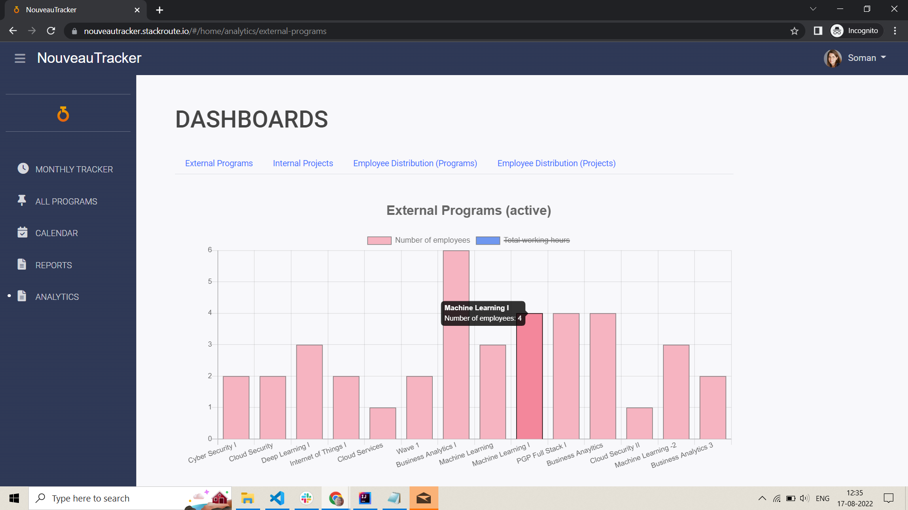

# NouveauTracker
NouveauTracker is a time-tracking system particularly built around the needs of  an operations team within growing Organizations. It takes care of everything from  program and project creation and enables employees to fill their daily tracker and  submit monthly tracker and creates consolidated and final reports for Operations  Team and FSO Team. The visual dashboard provides a comprehensive insight into the  reports. The system is based on Polyglot persistence (MySQL, MongoDB and  Elasticsearch). We built it using Spring boot and angular framework. It also uses  RabbitMQ queues. It is dockerized and deployed on AWS.

The system was up at https://nouveautracker.stackroute.io/ . Since the AWS service is expired now, I have uploaded the screenshots of all UIs. Go ahead and have a look!

