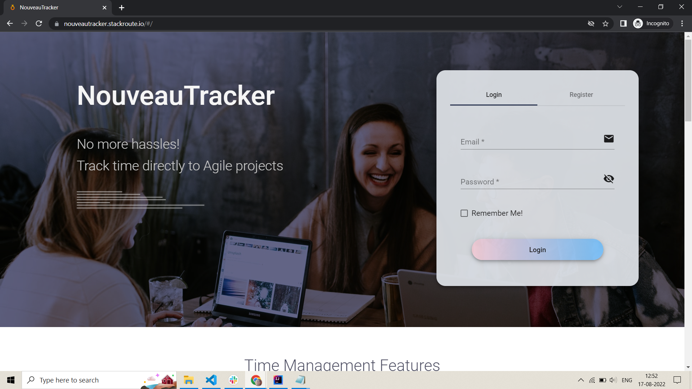

# NouveauTracker
NouveauTracker stands as a robust time-tracking system specifically tailored to meet the evolving demands of operational teams in growing organizations. Operating on a microservices architecture, this system seamlessly orchestrates program and project creation, streamlines daily tracker submissions, and facilitates monthly tracker compilation.

Employing polyglot persistence with MySQL, MongoDB, and Elasticsearch, NouveauTracker is meticulously crafted using Spring Boot and Angular, with RabbitMQ ensuring efficient queueing. Deployed on AWS and containerized via Docker, it is complemented by an intuitive visual dashboard providing a holistic view of reports. The utilization of a microservices architecture empowers scalable, autonomous services, fortifying the system's adaptability and operational agility.

The system was up at https://nouveautracker.stackroute.io/ . Since the AWS service is expired now, I have uploaded the screenshots of all the UIs. Go ahead and have a look!

